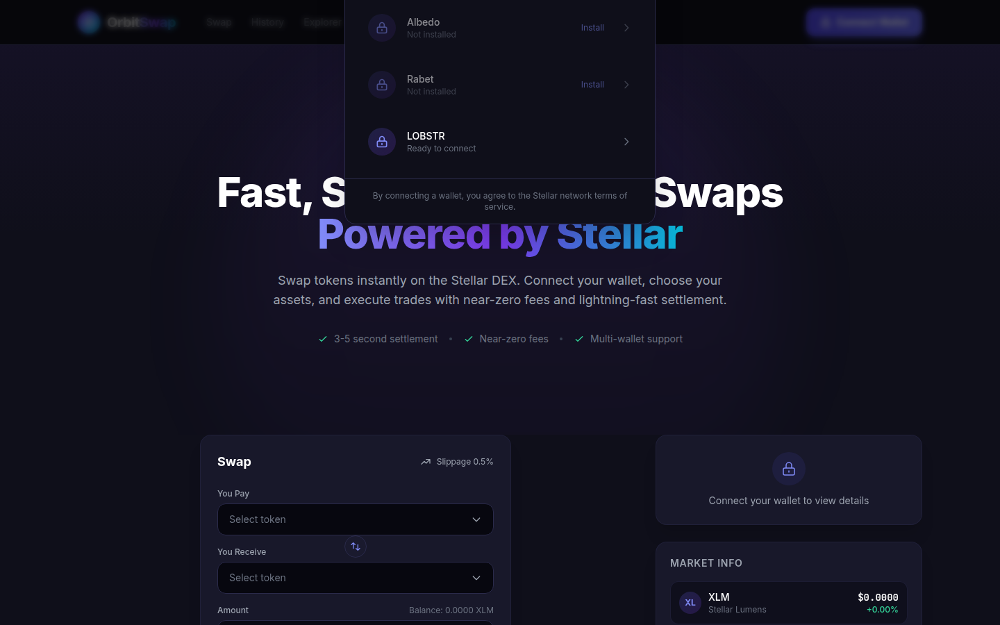

# OrbitSwap

<p align="center">
  
</p>

<h3 align="center">Fast, seamless token swaps powered by Stellar</h3>

<p align="center">
  
  
  
  
  
</p>

<p align="center">
  <a href="#live-demo"><strong>🌐 Live Demo</strong></a> ·
  <a href="#screenshots"><strong>📸 Screenshots</strong></a> ·
  <a href="#deployed-contract"><strong>⛓️ Deployed Contract</strong></a>
</p>

---

## Overview

OrbitSwap is a production-ready decentralized token swap application built on the **Stellar** network. Users can securely connect multiple Stellar wallets, browse supported assets, inspect Stellar DEX market information, interact with deployed Soroban smart contracts, execute token swaps, monitor transaction progress, and receive live blockchain updates through a responsive modern interface.

---

## Features

- 🔐 **Multi-Wallet Support** — Connect with Freighter, xBull, Albedo, Rabet, and LOBSTR via StellarWalletsKit
- 💱 **Token Swap Interface** — Production-quality DEX experience with real-time quotes
- 📊 **Market Information** — Live price feeds from Stellar DEX order books
- ⛓️ **Soroban Smart Contract** — Deployed contract for swap operations with read/write support
- 📡 **Real-Time Events** — Live contract event streaming and blockchain synchronization
- 📝 **Transaction Tracking** — Full lifecycle tracking: preparing → pending → confirmed
- 🔔 **Notifications** — Toast notifications for all wallet and transaction events
- 📱 **Responsive Design** — Optimized for desktop, tablet, and mobile
- ♿ **Accessibility** — Semantic HTML, keyboard navigation, ARIA labels, focus states
- 🧪 **Comprehensive Tests** — 29 passing tests covering hooks, components, and services

---

## Technology Stack

| Layer              | Technologies                                                |
| ------------------ | ----------------------------------------------------------- |
| **Frontend**       | React 18, TypeScript, Vite, Tailwind CSS                    |
| **Blockchain**     | Stellar SDK, Soroban SDK                                    |
| **Wallets**        | StellarWalletsKit (Freighter, xBull, Albedo, Rabet, LOBSTR) |
| **Smart Contract** | Soroban (Rust), deployed on Stellar Testnet                 |
| **State**          | Zustand                                                     |
| **Routing**        | React Router v6                                             |
| **Testing**        | Vitest, React Testing Library                               |
| **Linting**        | ESLint, Prettier                                            |
| **Build**          | Vite                                                        |

---

## Architecture

```
orbitswap/
├── contracts/
│   └── orbitswap/
│       ├── Cargo.toml              # Soroban contract manifest
│       └── src/
│           ├── lib.rs              # Smart contract implementation
│           └── test.rs             # Contract unit tests
├── public/
│   ├── favicon.svg
│   └── wallets/                    # Wallet icon SVGs
├── src/
│   ├── components/
│   │   ├── layout/                 # Navbar, Footer, Layout
│   │   ├── swap/                   # SwapCard, AssetSelector
│   │   ├── ui/                     # Button, Skeleton, StatusBadge, Toast
│   │   └── wallet/                 # WalletSelector, WalletPanel
│   ├── constants/                  # App configuration
│   ├── contracts/                  # Contract references
│   ├── hooks/                      # Custom React hooks
│   ├── pages/                      # HomePage, HistoryPage
│   ├── providers/                  # WalletProvider, ContractProvider
│   ├── services/                   # wallet.service, stellar.service, contract.service
│   ├── store/                      # Zustand state management
│   ├── styles/                     # Global CSS with Tailwind
│   ├── test/                       # Test setup and test files
│   └── types/                      # TypeScript type definitions
├── .env.example                    # Environment variables template
├── index.html
├── package.json
├── tailwind.config.js
├── tsconfig.json
└── vite.config.ts
```

---

## Installation

### Prerequisites

- **Node.js** >= 18
- **npm** >= 9
- A Stellar wallet browser extension (Freighter, xBull, Albedo, or Rabet)

### Setup

```bash
# Clone the repository
git clone https://github.com/your-username/orbitswap.git
cd orbitswap

# Install dependencies
npm install

# Copy environment configuration
cp .env.example .env
```

### Environment Variables

| Variable               | Description                             | Default                                                    |
| ---------------------- | --------------------------------------- | ---------------------------------------------------------- |
| `VITE_STELLAR_NETWORK` | Stellar network (`TESTNET` or `PUBLIC`) | `TESTNET`                                                  |
| `VITE_HORIZON_URL`     | Horizon API endpoint                    | `https://horizon-testnet.stellar.org`                      |
| `VITE_SOROBAN_RPC_URL` | Soroban RPC endpoint                    | `https://soroban-testnet.stellar.org`                      |
| `VITE_CONTRACT_ID`     | Deployed Soroban contract ID            | `CDMFGNFKQOJ3IRFN7GYL2B6242TWQX3JXLUHUZB3CLK2HNUT7VLYMNVN` |
| `VITE_APP_NAME`        | Application name                        | `OrbitSwap`                                                |
| `VITE_APP_URL`         | Application URL                         | `http://localhost:3000`                                    |

### Running Locally

```bash
npm run dev
```

Open [http://localhost:3000](http://localhost:3000) in your browser.

### Building for Production

```bash
npm run build
npm run preview
```

### Testing

```bash
# Run all tests
npm test

# Run tests in watch mode
npm run test:watch

# Run tests with coverage
npm run test:coverage
```

---

## 🌐 Live Demo

🔗 **[https://orbitswap-eta.vercel.app](https://orbitswap-eta.vercel.app)**

Deployed on [Vercel](https://vercel.com).

---

## 📸 Screenshots

### Wallet Options Available

<p align="center">
  
</p>

<p align="center">
  <em>Wallet selector modal showing all 5 supported Stellar wallets: Freighter, xBull, Albedo, Rabet, and LOBSTR</em>
</p>

---

## Wallet Setup

OrbitSwap supports **5 Stellar wallets** through StellarWalletsKit:

| Wallet        | Installation                                |
| ------------- | ------------------------------------------- |
| **Freighter** | [freighter.app](https://www.freighter.app/) |
| **xBull**     | [xbull.app](https://xbull.app/)             |
| **Albedo**    | [albedo.link](https://albedo.link/)         |
| **Rabet**     | [rabet.io](https://rabet.io/)               |
| **LOBSTR**    | [lobstr.co](https://lobstr.co/)             |

### Connecting a Wallet

1. Click the **"Connect Wallet"** button in the navigation bar
2. Select your preferred wallet from the list
3. Approve the connection request in your wallet extension
4. Your wallet address and balance will appear in the Wallet Panel

### Wallet Features

- **Multi-wallet switching** — Switch between wallets without refreshing
- **Auto-reconnect** — Persists wallet connection across page reloads
- **Address display** — Shows short address with copy-to-clipboard
- **Balance tracking** — Real-time balance updates every 15 seconds
- **Network badge** — Displays current Stellar network

---

## Smart Contract

### Contract Overview

The OrbitSwap Soroban smart contract manages:

- **Asset registry** — Maintains a list of supported swap assets
- **Swap estimation** — Calculates estimated output and fees
- **Swap execution** — Validates and executes token swaps with slippage protection
- **Admin controls** — Pause/unpause functionality for emergency stops
- **Events** — Emits `SwapExecuted` events for real-time tracking

### Contract Structure

```
contracts/orbitswap/
├── Cargo.toml
└── src/
    ├── lib.rs       # Contract + client implementation
    └── test.rs      # Contract tests (init, swap, pause)
```

### Deployed Contract

- **Network:** Stellar Testnet
- **Contract ID:** `CDMFGNFKQOJ3IRFN7GYL2B6242TWQX3JXLUHUZB3CLK2HNUT7VLYMNVN`
- **Soroban RPC:** [https://soroban-testnet.stellar.org](https://soroban-testnet.stellar.org)
- **Deployer:** `GDQY77NYQ2A4RYCQ4PKD2BFC532ECYEKPFHPS24POUHG7L4KLDB74567`

### Verified Contract Call

- **Transaction Hash (init):** `8f582b3bd3a59c4ed777e7f74f3c6b01ee859129d7658bd3999cfc9928a4ef73`
- **Stellar Expert:** [View on Explorer](https://stellar.expert/explorer/testnet/tx/8f582b3bd3a59c4ed777e7f74f3c6b01ee859129d7658bd3999cfc9928a4ef73)
- **Network:** Testnet
- **Function Called:** `init(admin: orbitswap-deployer)`

This is a Soroban contract invocation (`init` function), fully verifiable on Stellar Explorer.

### Deploying the Contract

```bash
# Install Rust and Soroban CLI
cargo install --locked soroban-cli

# Build the contract
cd contracts/orbitswap
cargo build --target wasm32-unknown-unknown --release

# Deploy to testnet (requires funded Stellar account)
soroban contract deploy \
  --wasm target/wasm32-unknown-unknown/release/orbitswap.wasm \
  --source <YOUR_SECRET_KEY> \
  --network testnet
```

### Contract Interaction

The frontend interacts with the contract via `ContractService`:

**Read Operations:**

- `get_assets()` — Fetch supported assets
- `get_swap_estimate()` — Get swap quote from contract
- `get_balance()` — Check contract balance for an asset

**Write Operations:**

- `swap()` — Execute a token swap with slippage protection
- `add_asset()` — Admin: add a new supported asset
- `pause()` / `unpause()` — Admin: emergency pause controls

### Real-Time Sync

Contract events are streamed via polling (every 5 seconds) using the Soroban RPC `getEvents` endpoint. Events are stored in the Zustand store and displayed in the Notifications panel.

---

## Transaction Lifecycle

Every transaction goes through a defined lifecycle:

```
Preparing → Awaiting Wallet Approval → Signing → Submitting → Pending → Confirmed
                                                                       ↘ Failed
                                                                       ↘ Rejected
                                                                       ↘ Timeout
```

Status badges are displayed with color-coded indicators:

- 🟡 **Pending states** — amber/yellow pulsing dot
- 🟢 **Confirmed** — green dot
- 🔴 **Failed/Rejected** — red dot
- ⚪ **Timeout** — gray dot

---

## Swap Flow

1. **Connect Wallet** — Select and connect a Stellar wallet
2. **Select Assets** — Choose input and output tokens from the asset selector
3. **Enter Amount** — Input the swap amount (or click MAX)
4. **Review Quote** — View exchange rate, network fee, and estimated output
5. **Confirm Swap** — Review the preview modal and confirm
6. **Track Transaction** — Monitor status with in-app tracking and Explorer links

---

## Error Handling

The application explicitly handles these error scenarios:

| Error                   | Display                     | Recovery              |
| ----------------------- | --------------------------- | --------------------- |
| Wallet not installed    | Installation guide + link   | Install wallet, retry |
| Wallet rejected request | User cancelled message      | Dismiss, retry        |
| Insufficient balance    | Current vs required balance | Add funds, retry      |
| Unsupported network     | Network mismatch warning    | Switch network        |
| Timeout                 | Transaction timeout notice  | Retry transaction     |
| Contract failure        | Friendly error message      | Dismiss, retry        |

---

## Stellar Explorer Links

All transactions include direct links to [Stellar Expert](https://stellar.expert/explorer/testnet) for on-chain verification.

---

## License

MIT © 2026 OrbitSwap

---

## Acknowledgments

Built for the **Rise In Stellar Builder Challenge – Level 2 (Yellow Belt)**.

Built with:

- [Stellar](https://stellar.org/) — Decentralized blockchain network
- [Soroban](https://soroban.stellar.org/) — Smart contract platform
- [StellarWalletsKit](https://github.com/Creit-Tech/Stellar-Wallets-Kit) — Multi-wallet integration
